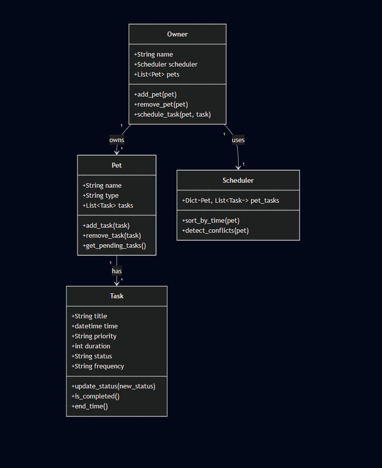

# PawPal+ (Module 2 Project)

You are building **PawPal+**, a Streamlit app that helps a pet owner plan care tasks for their pet.

## Scenario

A busy pet owner needs help staying consistent with pet care. They want an assistant that can:

- Track pet care tasks (walks, feeding, meds, enrichment, grooming, etc.)
- Consider constraints (time available, priority, owner preferences)
- Produce a daily plan and explain why it chose that plan

Your job is to design the system first (UML), then implement the logic in Python, then connect it to the Streamlit UI.

## What you will build

Your final app should:

- Let a user enter basic owner + pet info
- Let a user add/edit tasks (duration + priority at minimum)
- Generate a daily schedule/plan based on constraints and priorities
- Display the plan clearly (and ideally explain the reasoning)
- Include tests for the most important scheduling behaviors

## Getting started

### Setup

```bash
python -m venv .venv
source .venv/bin/activate  # Windows: .venv\Scripts\activate
pip install -r requirements.txt
```

### Suggested workflow

1. Read the scenario carefully and identify requirements and edge cases.
2. Draft a UML diagram (classes, attributes, methods, relationships).
3. Convert UML into Python class stubs (no logic yet).
4. Implement scheduling logic in small increments.
5. Add tests to verify key behaviors.
6. Connect your logic to the Streamlit UI in `app.py`.
7. Refine UML so it matches what you actually built.

### System Architecture (UML)
Here is the final UML diagram for PawPal+, showing classes, methods, and relationships:

<a href="uml_final.png" target="_blank">
  
</a>

## 📸 Demo
This is what the final PawPal+ app looks like in the browser:

<a href="pawpal_demo.png" target="_blank">
  
</a>

## Smarter Scheduling

The `Scheduler` class includes several methods that go beyond basic task storage:

- **`sort_by_time(pet=None)`** — Returns tasks sorted by start time. Pass a `Pet` to sort only that pet's tasks; omit it to sort across all pets.

- **`filter_tasks(pet=None, status=None)`** — Filters tasks by pet, status, or both. For example, retrieve only `"pending"` tasks for a specific pet, or all `"completed"` tasks across every pet.

- **`detect_conflicts(pet)`** — Returns a flat list of tasks that overlap in time for a given pet. A conflict occurs when one task starts before the previous one ends.

- **`get_conflict_pairs(pet)`** — Returns overlapping tasks as `(task_a, task_b)` tuples so you know exactly which two tasks clash. Returns an empty list if the pet has no tasks or isn't registered.

The `Task` class also supports **recurring tasks** via an optional `frequency` field (`"daily"` or `"weekly"`). When a recurring task is marked completed, `update_status("completed")` automatically returns a new `Task` scheduled for the next occurrence — ready to be added back to the pet's schedule.

## Testing PawPal+

Run the test suite with:

```bash
pytest tests/
```

To see detailed output for each test:

```bash
pytest tests/ -v
```

The test suite covers:

- **Sorting** — tasks returned in correct time order, single-pet scoping
- **Recurring tasks** — daily/weekly offsets, non-recurring returns `None`, new task starts as `"pending"`
- **Conflict detection** — overlapping tasks flagged, conflict pairs returned as tuples, no cross-pet false positives
- **Edge cases** — empty pets and unregistered pets return `[]` without crashing
